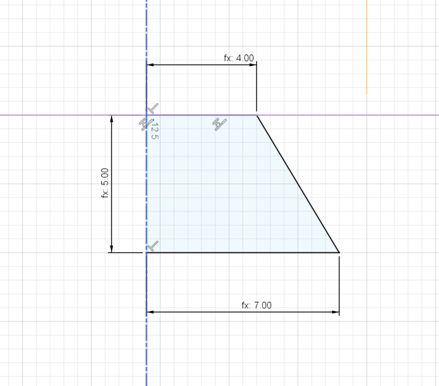

- Dovetail Description Language (DDL)
    - Expressed as three sequential numbers, representing each of the 3 primary parameters.
    - Parameters
        - Units
            - Const: mm
        - Half Base Width
            - Static
        - Height
            - Static
        - Half Top Width
            - Static
    - Ex. A **457** dovetail is 8mm wide at it's base (**4**&times;2). **5**mm tall and 14mm wide (**7**&times;2).
        - 
    - Implementation Types
        - Abstract
            - An abstract implementation may extend the standard without choosing a specific static parameter values.
        - Concrete
            - A concrete implementation must designate values for any Parameters marked as static.
    - Guidelines
        - Each implementation may extend the standard parameters and features, but must meet and not deviate from the base standard.
        - Suggested improvements to the base standard may be made via pull request.